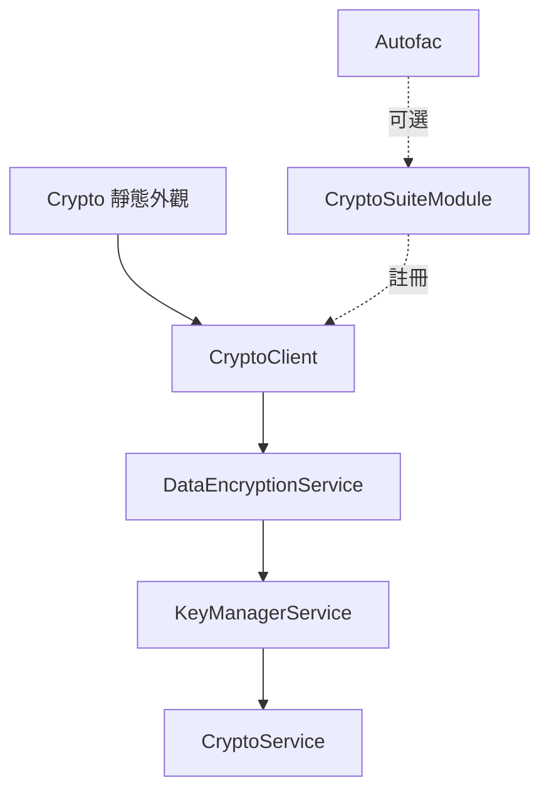

# B2B.CryptoLib Architecture（架構）

## Goals（目標）

B2B.CryptoLib 提供精簡的 .NET 10 執行階段介面，支援 AES、RSA、ECC 操作與
以金鑰組為基礎的文字加密。設計上將執行階段的金鑰使用與離線金鑰產生分離，
並要求明確指定目前使用的金鑰執行脈絡。

最重要的設計規則是：相依套件升級不得在沒有明確決策的情況下變成密碼格式
升級。`CRYPTO-COMPATIBILITY.md` 所描述的密文封裝格式、金鑰檔案配置、
舊版讀取器與生命週期規則，都是必須保留的相容性契約。

## Runtime layers（執行階段分層）

正常的高階流程刻意維持精簡：

- `Crypto` 擁有程序預設用戶端，並提供相容性的外觀介面。
- `CryptoClient` 擁有一組已正規化的 `CryptoOptions` 執行脈絡。
- `DataEncryptionService` 負責文字封裝格式、GCM v2 載荷與舊版 AES-CBC
  選擇。
- `KeyManagerService` 負責尋找、快取及明確發布完整金鑰組。
- `CryptoService` 是低階 AES-CBC、RSA 及 RSA/ECC 簽章的邊界。

## Static facade（靜態 Facade）

`Crypto.Initialize` 只建立一次程序預設執行脈絡。操作由鎖保護：相同的
正規化路徑與啟用名稱會視為冪等，不同設定則會被拒絕。初始化完成後，
一般外觀介面讀取使用 `Volatile.Read`，不會取得初始化鎖。

外觀介面不會讀取 `appsettings.json`、建立預設的 `Keys` 目錄、依名稱排序選金鑰，
也不會消費 `update` 檔案。金鑰發布必須透過 `Crypto.UpdateKeySetsAsync()` 明確
執行，這是具有檔案系統副作用的操作。

初始化前呼叫其他外觀介面方法會快速失敗。使用靜態外觀介面的程序通常只有一個
預設執行脈絡；下方提到的同根目錄多用戶端限制，指的是另外建構的用戶端，
不會改變一般單一執行脈絡外觀介面的模型。

## Isolated CryptoClient（隔離的 CryptoClient）

一個 `CryptoClient` 對應一個金鑰管理器、快取、目錄與可選的啟用統一名稱
執行脈絡。`CryptoClient.Create` 與公開建構函式不要求 Autofac，也不依賴舊版
靜態 `CryptoConfig`。

建構時會建立 `current`、`history` 與 `update` 目錄，這是必要的檔案系統副作用。
建構不會掃描、發布、搬移或消費 `update` 檔案。`Encrypt(value)` 只使用設定的
`ActiveUnifiedName`；省略該選項時，呼叫端必須使用 `Encrypt(value, unifiedName)`。
解密從密文尾綴取得金鑰名稱，不會使用 `ActiveUnifiedName`。

同一用戶端的執行階段操作可以並行使用。金鑰查找與發布由該用戶端的
`KeyManagerService` 閘門序列化；密碼原語與啟用名稱則維持個體專屬。
共用同一根目錄的兩個用戶端不會共用快取，也沒有跨用戶端的更新鎖；請在外部
協調更新，或每個根目錄只使用一個用戶端。

## Optional Autofac integration（可選的 Autofac 整合）

`CryptoSuiteModule` 是既有 Autofac 應用程式的配接器。它會以單例註冊
執行階段服務，包括 `ICryptoClient`、`IDataEncryptionService`、`ICryptoService`、
`ICryptoKeyService`、載入器與 `KeyManagerService`。傳入啟用名稱後，便可使用
不帶名稱的 `ICryptoClient.Encrypt` 多載。

對公開高階 API 而言，Autofac 不是執行階段必要條件；應用程式也可以直接建構
`CryptoClient`。獨立的 `KeyGenerationModule` 屬於離線工具邊界，不應註冊到 Web
應用程式。

## Crypto primitives（密碼原語）

目前文字寫入使用 AES-GCM、隨機 12 位元組 nonce（隨機數）與 128 位元訊息驗證標籤。
統一名稱會以 UTF-8 編碼作為 AAD。低階 AES 服務仍保留沒有 GCM 標記的
舊版載荷所需的 AES-CBC 與 PKCS#7 路徑。

RSA 資料包裝使用 OAEP。舊版金鑰組讀取器在獨立路徑使用 RSA PKCS#1 v1.5。
RSA 與 ECC 簽章使用 PEM 金鑰模型及既有 SHA-256 簽章演算法。這些選擇是刻意
定義的相容性邊界，而不是可以任意改動的實作細節；變更前請閱讀
[密碼相容性契約](CRYPTO-COMPATIBILITY.md)。

## Key management（金鑰管理）

`KeyManagerService` 將完整的三檔金鑰組視為發布單位。查找順序是 `current`
優先於 `history`，v2 副檔名優先於舊版副檔名；依統一名稱快取載入後的 RSA
與 AES 模型。

明確更新會掃描 `update`、略過不完整組合，並依公開金鑰、私鑰、AES 材料
順序複製；只有整組複製完成後才刪除來源檔案。每個目的檔案都先寫入暫存檔再
原子取代。AES 檔案最後寫入，因為它是告知執行階段「完整金鑰組存在」
的辨識標記。失敗組合會留在 `update` 以供重試；成功發布後會清除
執行該更新個體的快取。

## Key generation（金鑰產生）

`B2B.CryptoLib.KeyGeneration` 是可重用的離線組件。它使用舊版程序層級
`CryptoConfig`，因為金鑰產生工具會在建立 Autofac 容器前先載入
`appsettings.json`。它可以產生 RSA、ECC 或 AES 模型，也可以產生供暫存用的
完整 RSA/AES 金鑰組。

金鑰產生刻意不放在執行階段相依方向中：執行階段讀取受保護的金鑰檔案，離線
工具則透過受控的部署流程建立並發布這些檔案。

## Configuration boundaries（設定邊界）

`CryptoOptions` 是執行階段設定。金鑰根目錄會正規化為完整路徑，可選的啟用
名稱只接受英文字母、數字、`_` 與 `-`。函式庫不替部署決定根目錄是否位於
原始碼樹、Web 根目錄或可公開寫入目錄之外；這是部署環境的安全政策責任。

`CryptoConfig` 是離線產生器與工具使用的舊版靜態設定。執行階段的
`Crypto` 與 `CryptoClient` 不會隱式讀取它。

## Thread safety（執行緒安全）

靜態外觀介面會序列化初始化，並對已建立的預設用戶端使用無鎖的 volatile
讀取。以等價的正規化設定重新初始化是安全且冪等的；不同設定會被拒絕。

每個 `CryptoClient` 都有個體專屬的金鑰管理鎖。同一個體的更新與
金鑰查找不會看到自己尚未完成的發布。這不會協調共用相同檔案的獨立用戶端或
程序。公開的 `UpdateKeySetsAsync` 名稱為了生命週期/API 相容性保留非同步外觀，
但目前更新掃描會在其回傳工作完成前同步完成。

## Cache model（快取模型）

RSA 與 AES 模型依統一名稱延遲載入。`current` 優先於 `history`，只有完整金鑰
組才會回傳模型。成功更新後會清除執行更新個體的兩個快取，因此下次存取
既有名稱時會重新讀取替換後的檔案。

繞過 `StartAsync` 的外部檔案變更不在快取契約內。遇到這種變更時，請協調程序
重新啟動或建立新的用戶端；不要假設其他用戶端會看到或清除這個用戶端的快取。

## Dependency boundaries（相依性邊界）

執行階段函式庫直接使用 Autofac 的可選模組、Newtonsoft Json 的金鑰模型
序列化，以及 BouncyCastle.Cryptography 的密碼原語。KeyGeneration 參考執行
階段契約並使用同一組密碼相依套件。測試與離線工具是獨立專案，不屬於執行階段
套件 API。

## Non-goals（非目標）

此儲存庫不定義宿主專用的內容根目錄政策、Web 託管拓撲、資料庫查找
行為、金鑰託管、秘密管理或遠端金鑰分發協定。它也不會把
`IsValidEncryptedFormat` 變成訊息驗證或授權機制。宿主應用程式
必須自行提供權限、備份、秘密儲存與部署協調。
