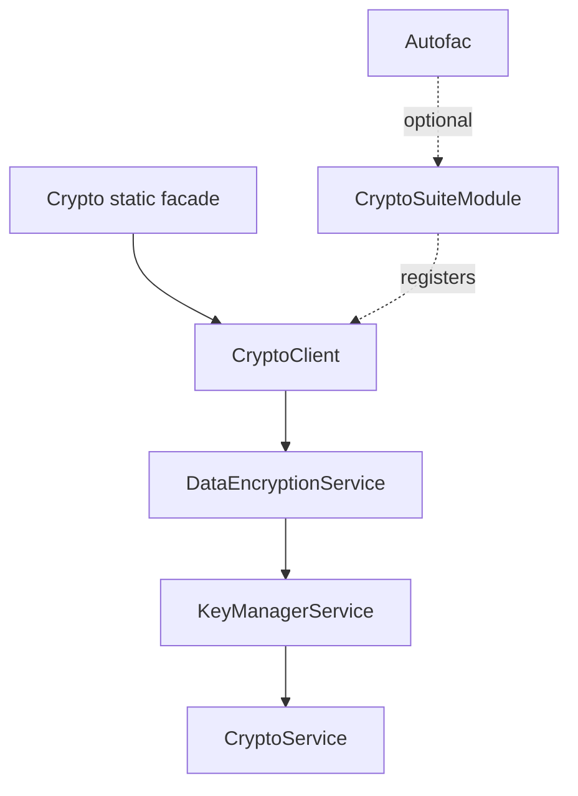

# B2B.CryptoLib Architecture

## Goals

B2B.CryptoLib provides a small .NET 10 runtime surface for AES, RSA and ECC
operations, plus key-set based text encryption. The design keeps runtime key
consumption separate from offline key generation and makes the active key
context explicit.

The most important design rule is that a dependency upgrade must not silently
become a cryptographic format upgrade. The ciphertext envelope, key layouts,
legacy readers and lifecycle rules described in
[CRYPTO-COMPATIBILITY.md](CRYPTO-COMPATIBILITY.md) are compatibility contracts.

## Runtime layers

The normal high-level path is deliberately narrow:

- `Crypto` owns the process default client and exposes the compatibility facade.
- `CryptoClient` owns one normalized `CryptoOptions` context.
- `DataEncryptionService` owns the text envelope, GCM v2 payload and legacy
  AES-CBC selection.
- `KeyManagerService` finds, caches and explicitly publishes complete key sets.
- `CryptoService` is the low-level AES-CBC, RSA and RSA/ECC signature boundary.

## Static facade

`Crypto.Initialize` creates the process default context once. The operation is
protected by a lock: the same normalized path and active name are idempotent,
while a different configuration is rejected. After initialization, normal
facade reads use `Volatile.Read` and do not take the initialization lock.

The facade does not read `appsettings.json`, create a default `Keys` directory,
choose a key by sorting names, or consume `update` files. Publishing is an
explicit side effect through `Crypto.UpdateKeySetsAsync()`.

Using any other facade method before initialization fails fast. A process using
the static facade normally has one default context; the same-root multi-client
limitation below concerns separately constructed clients and does not change
the normal single-context facade model.

## Isolated CryptoClient

One `CryptoClient` equals one key-manager, cache, directory and optional active
unified-name context. `CryptoClient.Create` and its public constructor do not
require Autofac and do not depend on the legacy static `CryptoConfig`.

Construction creates the `current`, `history` and `update` directories as a
necessary filesystem side effect. It does not scan, publish, move or consume
files in `update`. `Encrypt(value)` uses only the configured
`ActiveUnifiedName`; when that option is absent, the caller must use
`Encrypt(value, unifiedName)`. Decryption obtains the key name from the
ciphertext suffix, not from `ActiveUnifiedName`.

Runtime operations on one client can be used concurrently. Key lookup and
publication are serialized by that client's `KeyManagerService` gate, while
the crypto primitives and active-name value are otherwise instance-local. Two
clients that share a root do not share cache state or an inter-client update
lock; coordinate updates externally or use one client per root.

## Optional Autofac integration

`CryptoSuiteModule` is an adapter for existing Autofac applications. It
registers runtime services as singletons, including `ICryptoClient`,
`IDataEncryptionService`, `ICryptoService`, `ICryptoKeyService`, loaders and
`KeyManagerService`. Passing an active name to the module enables the
no-name `ICryptoClient.Encrypt` overload.

Autofac is not a runtime requirement for the public high-level API: an
application can construct `CryptoClient` directly. The separate
`KeyGenerationModule` belongs to the offline tool boundary and should not be
registered in a web application.

## Crypto primitives

The current text writer uses AES-GCM with a random 12-byte nonce and a 128-bit
authentication tag. The unified name is UTF-8 encoded as AAD. The low-level AES
service retains AES-CBC with PKCS#7 for old payloads without the GCM marker.

RSA data wrapping uses OAEP. The legacy key-set reader uses RSA PKCS#1 v1.5 in
a separate path. RSA and ECC signatures use the PEM key models and the existing
SHA-256 signature algorithms. These choices are intentionally documented
boundaries rather than implementation details; see
[CRYPTO-COMPATIBILITY.md](CRYPTO-COMPATIBILITY.md) before changing them.

## Key management

`KeyManagerService` treats a complete three-file key set as its unit of
publication. It searches `current` before `history`, and v2 file extensions
before legacy extensions. It caches loaded RSA and AES models per unified name.

An explicit update scans `update`, skips incomplete groups, copies public key,
private key and AES material in that order, and removes source files only after
the group has been copied. Each destination is written through a temporary file
and atomic replacement. The AES file is last because it is the discovery marker
that tells the runtime a complete key set exists. A failed group remains in
`update` for retry. Successful publication clears the instance-local caches.

## Key generation

`B2B.CryptoLib.KeyGeneration` is a reusable offline assembly. It uses the
legacy process-wide `CryptoConfig` because the key-generation tool loads
`appsettings.json` before constructing its Autofac container. It produces RSA,
ECC or AES models, or a complete RSA/AES key set for staging.

Key generation is intentionally not part of the runtime dependency direction:
the runtime reads protected key files, while the offline tool creates and
publishes them through a controlled deployment process.

## Configuration boundaries

`CryptoOptions` is the runtime configuration. Its key root is normalized to a
full path and its optional active name accepts only letters, numbers, `_` and
`-`. The library does not decide whether that root is outside a source tree,
web root or publicly writable directory; deployment owns that security policy.

`CryptoConfig` is the legacy static configuration used by offline generators
and the tool. Runtime `Crypto` and `CryptoClient` do not read it implicitly.

## Thread safety

The static facade serializes initialization and uses lock-free volatile reads
for its already-created default client. Reinitialization with an equivalent
normalized configuration is safe and idempotent; a different configuration is
rejected.

Each `CryptoClient` has an instance-local key-manager lock. An update and key
lookup on that instance cannot observe its own in-progress publication. This
does not coordinate independent clients or processes sharing the same files.
The public `UpdateKeySetsAsync` name is asynchronous for lifecycle/API
compatibility, but the current update scan completes synchronously before its
returned task completes.

## Cache model

RSA and AES models are loaded lazily by unified name. `current` wins over
`history`, and a complete set is required before any model is returned. A
successful update clears both caches on the updating instance so a replacement
under an existing name is read on the next access.

External file changes that bypass `StartAsync` are outside the cache contract.
For those changes, use a coordinated process restart or create a new client;
do not assume another client will observe or invalidate this client's cache.

## Dependency boundaries

The runtime library directly uses Autofac for its optional module, Newtonsoft
Json for key-model serialization and BouncyCastle.Cryptography for the
cryptographic primitives. Key generation references the runtime contracts and
uses the same cryptographic dependency family. Tests and the offline tool are
separate projects and are not part of the runtime package API.

## Non-goals

This repository does not define host-specific content-root policy, web hosting
topology, database lookup behavior, key escrow, secret management, or a remote
key distribution protocol. It also does not make `IsValidEncryptedFormat` an
authentication or authorization mechanism. Host applications must provide
permissions, backup, secret storage and deployment coordination.
